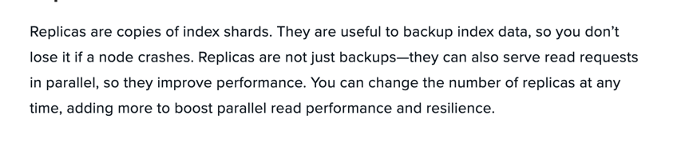

### 关于ES的相关中要的概念

鉴于时间关系不一个个全部写了(自己大概也知道)，不过看到一片不错的文章，方便随时查看。

包括，基本概念，各种平台的部署，以及附加的描述

[参考链接](https://cloud.netapp.com/blog/cvo-blg-elasticsearch-concepts-deployment-options-and-best-practices)

es的官方文档也是不错的选择
!!! 特别注意因版本带来的问题

有几个还是需要在梳理一下

***sharps***

````text

1：首先需要知道的是 ES 中所有的数据是均衡的存储在集群中的各个节点的分片中的。
2：在创建index的时候，可以指定对index的分片数量(默认是1)
3：每个分片都是一个独立的lucene instance
4：每个index的size是有上限的。达到上限后，需要进行split从而提高performance
5: 一个index包含多个sharps，也就是说一个index可以存在多个服务器上
6：每个sharp是最小的工作单元，承载部分数据
7：增减节点时，sharp会自动在nodes中负载均衡

````

***Replicas***

replicas是index sharps的副本(copy)。通常是用来备份index data的，下面这个解释就非常好



[相关参考链接](https://blog.csdn.net/sinat_16658263/article/details/90444038)

***index***

Elastic会索引所有的字段，经过处理后写入一个反向索引(inverted index)，查找数据的时候，直接查找该索引，所以es数据管理的顶层单位就叫索引(index)
可以类比数据库的表，每个index的名字必须是小写。

***Document***

index里的单条纪录称之为Document(文档),许多条Document构成了一个index。Document使用JSON格式来表示。

***Type***

在6.x的版本中，只允许每个index包含一个Type,后续的版本都废弃，移除了，这里不做讨论。