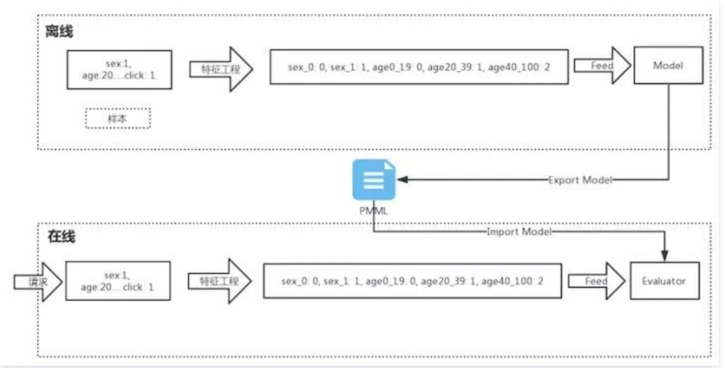

### 关于python在java的调用-初步调研
****

***关于pmml概念***

```text

PMML是 Predictive Model Markup Language的缩写，翻译为中文就是"预测模型标记语言"， 他是基于xml的标准语言，用于表达数据挖掘模型，
可以用来在不同的应用程序中交换模型，也就是说它定义了一个标准，不同语言可以根绝这个标准来实现。关于PMML的内部实现细节，不做讨论。

```

***PMML能做什么***

```text

对于上述的概念可能有点疑惑，或者是抽象。
先来说说它的用处，对于PMML，使用一个应用程序很容易在一个系统上开发模型，并且只需要通过发送XML配置文件，就可以在另一个系统山使用另外一个
应用程序部署模型。就是说我们可以通过python/R训练模型，将模型转化为PMML文件，再使用java，根据PMML的文件来构建java程序。
如下图所示

```



- 整个流程分为两部分：离线和在线。
- 离线部分流程是将样本进行特征工程，然后进行训练，生成模型。一般离线部分常用 Python 中的 sklearn、R 或者 Spark ML 来训练模型。
- 在线部分是根据请求得到样本数据，对这些数据采用与离线特征工程一样的方式来处理，然后使用模型进行评估。一般在线部分常用 Java、C++ 来开发。
- 离线部分与在线部分是通过 PMML 连接的，也就是说离线训练好了模型之后，将模型导出为 PMML 文件，在线部分加载该 PMML 文件生成对应的评估模型。

我们可以看到，PMML 是连接离线与在线环节的关键，一般导出 PMML 文件和 加载 PMML 文件都需要各个语言来做单独的实现。
不过幸运的是，已经有很多大神实现了这些，可以参见：https://github.com/jpmml 。
